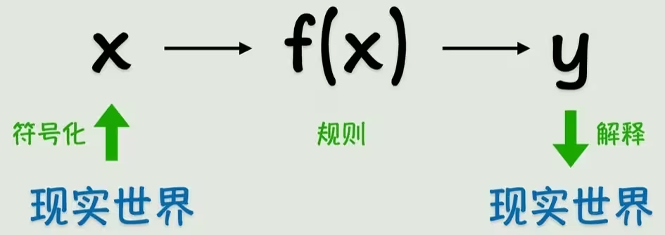

# 从函数到 Transformer：深度学习全景核心指南

在这个教程中，我们将带你从最基础的数学函数出发，一步步揭开神经网络的神秘面纱，最终理解当下最前沿的自然语言处理架构——Transformer。这是一次从简单规则到复杂智能的奇妙旅程。

---

## 1. 现实世界与数学符号的映射
我们认识世界的过程，往往是将现实世界的事物**符号化**。通过建立一定的**规则**（即数学中的函数 $f(x)$）对输入进行转换，然后再对计算结果进行**解释**，最终映射回现实世界。

机器学习的核心，也是在寻找这样一个从输入 $x$ 到输出 $y$ 的最优函数 $f(x)$。

## 2. 线性回归：最基础的模型规则
在众多的函数规则中，最简单的是线性模型。比如一条一元一次方程直线 $y = wx + b$。
在这个公式中：
- $x$ 是输入特征；
- $w$ 代表**权重（Weight）**，决定了 $x$ 的重要程度；
- $b$ 代表**偏置（Bias）**，相当于基准线。
我们的目标就是通过不断调整权重 $w$ 和偏置 $b$，让这条直线尽可能地穿过我们拥有的数据点，从而实现**拟合**。
.png)

## 3. 激活函数：赋予模型非线性的灵魂
虽然线性模型简单直观，但现实世界的问题往往不是简单的直线关系，而是高度非线性的。如果我们的模型只使用线性组合，无论嵌套多少层，最终等效的结果仍然是一条直线（线性映射）。
因此，我们需要在每一层计算后引入**激活函数 (Activation Function)** $g(x)$，例如 Sigmoid 或者 ReLU（$ReLU(z) = \max(0,z)$）。
激活函数就像一个“弯曲器”，它能够扭曲原本笔直的线，给模型加入非线性表达能力，让神经网络能够拟合各种复杂的曲线和边界。
.png)

## 4. 复合函数：构建多层嵌套的智能
有了激活函数之后，我们就可以将简单的函数进行嵌套组合，形成更深层次的映射关系。例如：$g(w_3 g(w_1 x_1 + w_2 x_2 + b_1) + b_2)$。
在这个公式中，内部的结果成为了外部的输入，一层一层递进。这其实就是神经网络进行信息处理的核心数学逻辑。
.png)

## 5. 从数学公式到神经元
为了让这种多层嵌套更加直观，我们把它画成了图结构。我们将输入、权重计算和激活函数合并成一个节点，称之为**神经元**。
多个神经元排列组合在一起，就构成了包含**输入层**（负责接收数据）、**隐藏层**（负责特征提取和转换）和**输出层**（负责得出最终结论）的**人工神经网络 (Artificial Neural Network, ANN)**。
.png)

## 6. 前向传播与深度网络架构
在神经网络中，数据从输入层出发，经过中间隐藏层的层层计算，最后传递到输出层得出预测结果的过程，叫做**前向传播 (Forward Propagation)**。
当我们不断增加隐藏层的层数和每一层神经元的节点数时，网络变得“深不可测”，我们就得到了所谓的**深度神经网络 (Deep Neural Network, DNN)**。层数越深，模型能够提取的特征就越抽象和高级。
.png)

## 7. 预测值与真实值的偏差
我们的网络在初始状态下（即随机赋予权重和偏置时），其预测结果往往是极其不准确的。
图中清晰地展示了模型的**预测值**（$\hat{y}$，直线上对应的点）与数据集中的**真实值**（$y$，空间中实际的点）之间存在明显的差距。
.png)

## 8. 损失函数：衡量模型“差劲程度”的标尺
为了用数学手段量化这种“预测与真实的差距”，我们定义了**损失函数（Loss Function）**。
最常用的损失函数包括绝对误差和**均方误差（Mean Squared Error, MSE）**：$L(w,b) = \frac{1}{N}\sum (y_i - \hat{y}_i)^2$。
损失函数就像是模型的一个错题本，它的值越大，说明模型错得越离谱；我们的最终目标，就是让这个损失函数的值**尽可能小**。
.png)

## 9. 梯度下降：寻找最优解的下山之路
面对复杂的网络，如何找到能使损失函数最小的权重 $w$ 和偏置 $b$ 呢？我们使用**梯度下降（Gradient Descent）**算法。
它的原理相当于“蒙着眼睛下山”：通过计算损失函数对各个参数的偏导数（即梯度，它指明了当前最陡峭的上山方向），然后朝其反方向，以**学习率（Learning Rate，$\eta$）**为步长不断更新参数。
更新公式为：$w = w - \eta \frac{\partial L}{\partial w}$。
.png)

## 10. 反向传播：高效计算梯度的核心
在深层网络中，参数可能有成百上千万个。为了高效地计算这么庞大数量的参数对损失函数的梯度，AI科学家们发明了**反向传播算法（Backpropagation, BP）**。
它巧妙地利用了微积分中的**链式法则**，将输出层计算出的误差，一层一层地反向“甩锅”回给上一层，直至输入层，从而精准计算出每个节点的梯度。
.png)

## 11. 过拟合与正则化技术
在训练过程中，如果模型结构过于复杂或者训练过度，模型可能会把数据里的“噪声”也学进去。这种在训练集上表现极好、但在没见过的测试集上表现极差的现象，叫做**过拟合（Overfitting）**。这就像死记硬背了题库，却不懂得举一反三。
.png)

为了防止过拟合，我们引入了正则化（Regularization）技术，尤其是近年来广泛使用的 **Dropout**。
Dropout 在训练时会随机“丢弃”（即临时关闭）一部分神经元，迫使网络不依赖于某些特定的节点特征，从而增强模型的鲁棒性和泛化能力。
.png)

---

## 12. 迎接矩阵时代与 CNN (卷积神经网络)
进入复杂的图像处理和自然语言领域前，我们需要将数据从一维标量进化为**多维矩阵和张量**。图像在计算机眼中，就是由一个个像素点构成的大型数字矩阵。如果使用之前的全连接网络，会导致参数量呈爆炸式增长，因此我们需要更高效的方法。
.png)

这就是 **卷积神经网络 (Convolutional Neural Network, CNN)** 诞生的契机。CNN 不再让每个神经元连接所有像素，而是使用一组组**卷积核（Filter/Kernel）**。
.png)

这些卷积核就像是探照灯，在图像矩阵上不断滑动，进行乘加运算，从而提取局部的特征（如边缘、纹理等）。不同卷积核能提取不同的特征图（Feature Map）。
.png)

在卷积层之后，往往会跟随一个**池化层（Pooling Layer）**（例如最大池化 Max Pooling）。池化层对图像进行降采样，它通过保留某个区域内的最大值，不仅大大减少了数据的维度和计算量，还赋予了模型一种“平移不变性”（即无论物体在左边还是右边，都能被认出来）。
.png)

将多个“卷积+激活+池化”模块堆叠起来，最后再加上全连接层，就构成了经典的 CNN 架构，统治了多年的计算机视觉领域。
.png)

---

## 13. 突破时序：RNN (循环神经网络)
CNN 擅长处理静态的、具备空间局部性的数据（如图片）。但在处理文字、语音、股票价格等具有前后顺序的**序列数据**时，就显得捉襟见肘了。因为翻译一句话，你必须知道前文才能理解后文。

这就需要 **循环神经网络 (Recurrent Neural Network, RNN)**。RNN 的核心创新在于它加入了一个隐藏状态，能够在处理当前时间步（Time Step）输入的同时，接收并记忆上一个时间步传过来的信息。
.png)

如果我们把 RNN 按照时间步展开（Unroll），它看起来就像是多个相同的网络排成了一列，信息在时间线上从左向右持续流动，实现了所谓的“长期记忆”。
.png)

## 14. 语言的数学表达：词嵌入 (Word Embedding)
在神经网络处理文本前，计算机只能处理数字。如果只使用简单的独热编码（One-hot），不仅维度极高而且无法表现词语间的相似度。

于是我们使用 **词嵌入（Word Embedding）** 技术。词嵌入通过神经网络训练，把每一个单词映射（压缩）到一个相对低维的、连续的密集向量空间（实数向量）中。
.png)

在这个高维空间里，语义相近的词（比如“猫”和“狗”）它们的向量距离会非常近，而且还能体现出神奇的数学关系（如 $国王 - 男人 + 女人 \approx 女王$）。
.png)

最终，一篇文本就像图片一样，被转化成了一个由词向量堆叠而成的巨大矩阵，源源不断地送入深度学习网络。
.png)

---

## 15. 注意力机制 (Attention)：让模型学会聚焦
早期的 RNN 在处理长序列时存在“遗忘”和“长距离依赖”的致命问题（句子太长，开头的词到结尾就忘光了）。

为了解决这个问题，研究人员提出了 **注意力机制（Attention Mechanism）**。正如人类在看一幅画或读一句话时，注意力只会集中在关键部分一样，注意力机制让模型在生成当前词时，自动去“回看”输入序列中与当前任务最相关的部分，动态赋予它们更高的权重。
.png)

## 16. Transformer 的崛起与自注意力机制 (Self-Attention)
2017年，Google 提出了震古烁今的 **Transformer** 架构。这篇名为《Attention Is All You Need》的论文宣称：完全抛弃 RNN 和 CNN，仅仅凭借注意力机制，就能达到极其惊人的效果。

Transformer 的灵魂是 **自注意力机制 (Self-Attention)**。在理解一句话时，它会计算句子中每一个词与句子中其他所有词的关联程度。
为了实现这一点，它为每个词生成了三个专属向量：
- **Query (Q)**：查询向量（我要找什么特征？）
- **Key (K)**：键向量（我具有什么特征？）
- **Value (V)**：值向量（我本身的实际内容）
.png)

计算自注意力时，将某个词的 Q 向量与其他所有词的 K 向量进行点积相乘，得分越高，代表相关性越强。随后经过 Softmax 归一化为概率权重，最后再用这个权重去加权平均所有的 V 向量，从而得到该词融合了全句上下文信息的新表达。
.png)

在生成文本（解码）时，为了防止模型“偷看”未来的词，还引入了带掩码的注意力（Masked Attention）。
.png)

## 17. 多头注意力与完整架构
不仅如此，Transformer 使用了 **多头注意力 (Multi-Head Attention)**。相当于安排了好几个不同的“注意力组”，有的组负责关注语法结构，有的组负责关注人物指代，有的组负责时态情绪。它们各自计算后拼接到一起，极大丰富了模型提取复杂信息的能力。
.png)

Transformer 整体上由 **编码器 (Encoder)** 和 **解码器 (Decoder)** 构成。
在编码器中，数据通过自注意力层和前馈全连接层（Feed Forward）进行充分的特征提取。
.png)

而在解码器中，除了自注意力机制，还增加了一个 **Encoder-Decoder Attention** 层，专门用于在翻译或生成文本时，将注意力放在源语言中相关的词语上。
.png)

以上所有精妙的组件组合起来，再加入残差连接（Add & Norm）和位置编码（Positional Encoding），就构成了统治当今大模型时代的 **Transformer 完整架构**。
从函数到如今的 Transformer，深度学习跨越了数学与直觉的重重屏障，终于赋予了机器理解人类语言的强大能力。
.png)

---
*附：还有一些辅助图片说明（对应部分特定的激活层细微差别或向量可视化展示，可供补充参考）*
.png)
